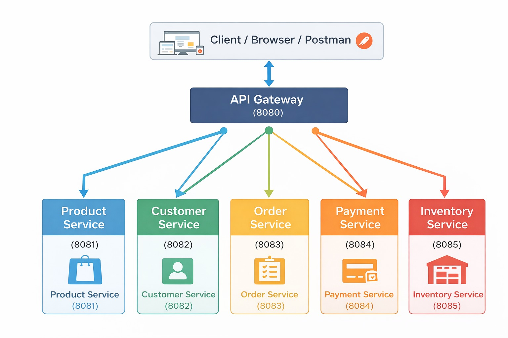
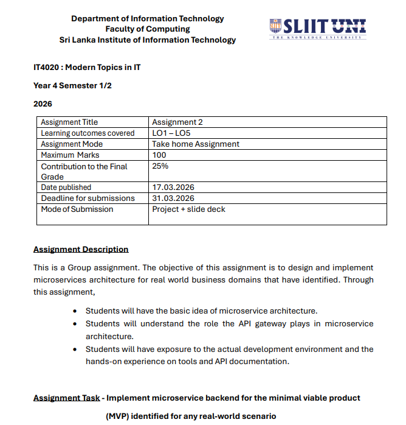

# MTIT-microservices-architecture





## Microservices Defined
1. **Product API (product-service)**: Manages all product-related CRUD operations, such as creating, fetching, updating, and deleting products in the catalog.
2. **Payment API (payment-service)**: Handles all transactions, payment processing, and checkout mechanics for the application.
3. **Order API (order-service)**: Handles order creation and tracking within the system.
4. **Customer API (customer-service)**: Handles customer data and accounts.

## API Gateway
The application includes an API Gateway (`api-gateway`) running on port `8080` that proxies all requests to their respective microservices. This consolidates the ports, allowing frontends to interact with a single unified base URL.
- **Products API Proxy Route**: `http://localhost:8080/api/products` -> proxies to `3002`
- **Payments API Proxy Route**: `http://localhost:8080/api/payments` -> proxies to `8084`
- **Customers API Proxy Route**: `http://localhost:8080/api/customers` -> proxies to `5002`
- **Orders API Proxy Route**: `http://localhost:8080/api/orders` -> proxies to `5003`

All microservices have Swagger Documentation properly configured natively and via the gateway endpoints (`/docs/<service>`).

## How to Run

1. **Install Dependencies**:
   Ensure you have [Node.js](https://nodejs.org/) installed. Then, open your terminal at the root of the project and install all dependencies for the individual microservices:
   ```bash
   cd product-service && npm install
   cd ../payment-service && npm install
   cd ../customer-service && npm install
   cd ../order-service && npm install
   cd ../api-gateway && npm install
   ```

2. **Start the Services**:
   You can easily start all the node processes concurrently using the provided PowerShell script at the root directory:
   ```powershell
   .\start-all.ps1
   ```
   *Alternatively, you can open three separate terminal windows and run `npm start` in each of the three directories (`product-service`, `payment-service`, and `api-gateway`).*

3. **Verification**:
   Once running, you can open the following links in your web browser to test the architecture:
   - **Product Service Direct Docs**: [http://localhost:3002/api-docs](http://localhost:3002/api-docs)
   - **Payment Service Direct Docs**: [http://localhost:8084/api-docs](http://localhost:8084/api-docs)
   - **API Gateway Base**: [http://localhost:8080/](http://localhost:8080/)
   - **Swagger through Gateway**: [http://localhost:8080/docs/products](http://localhost:8080/docs/products)